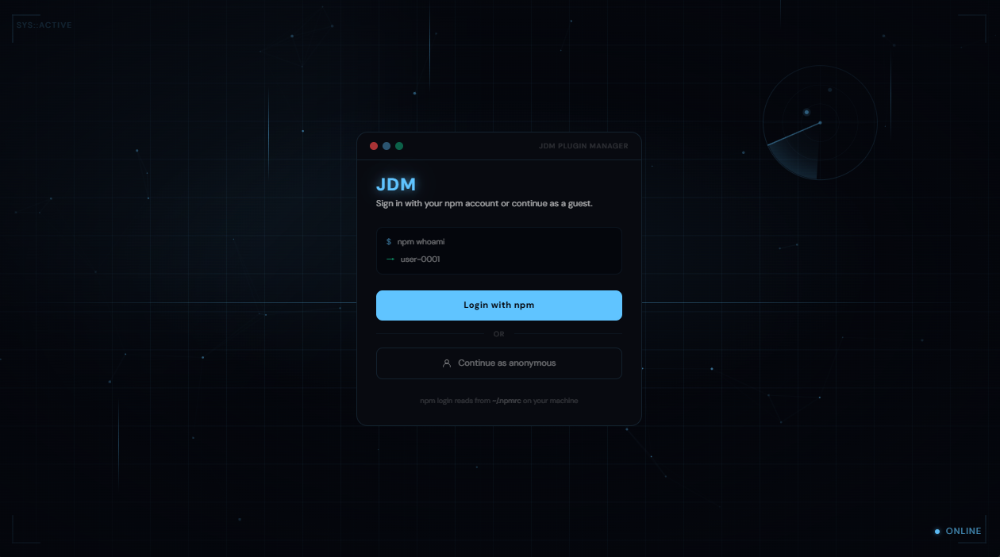
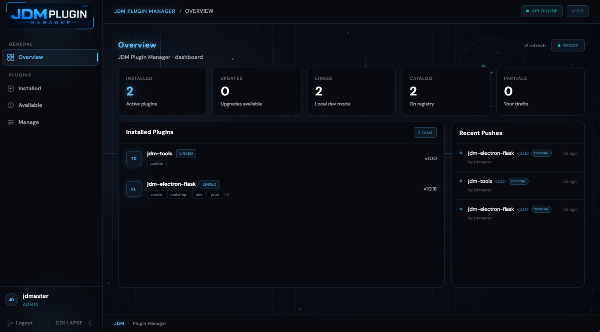
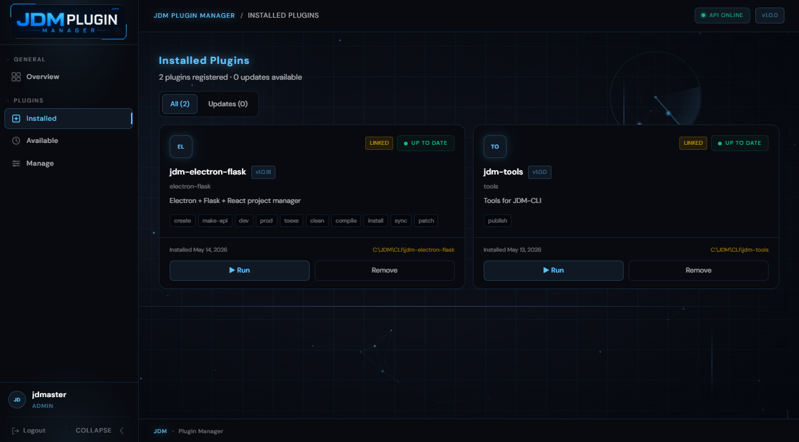
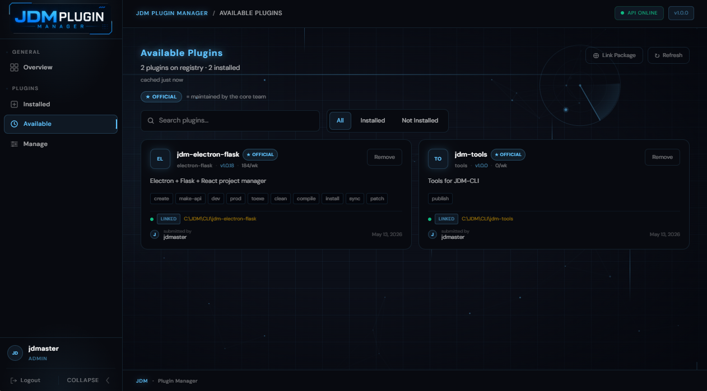
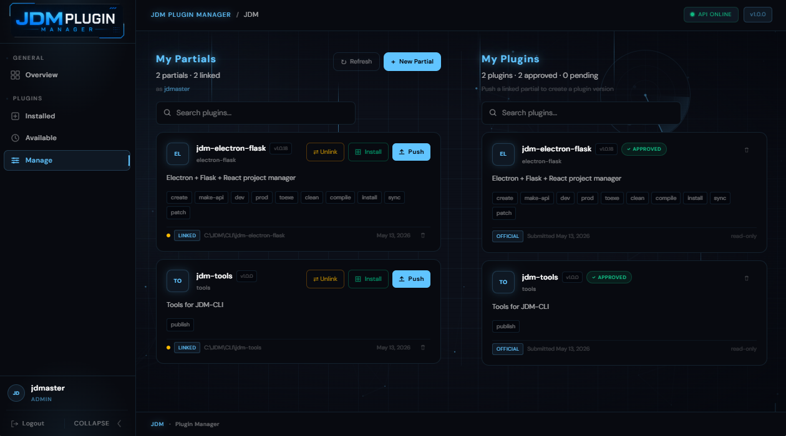
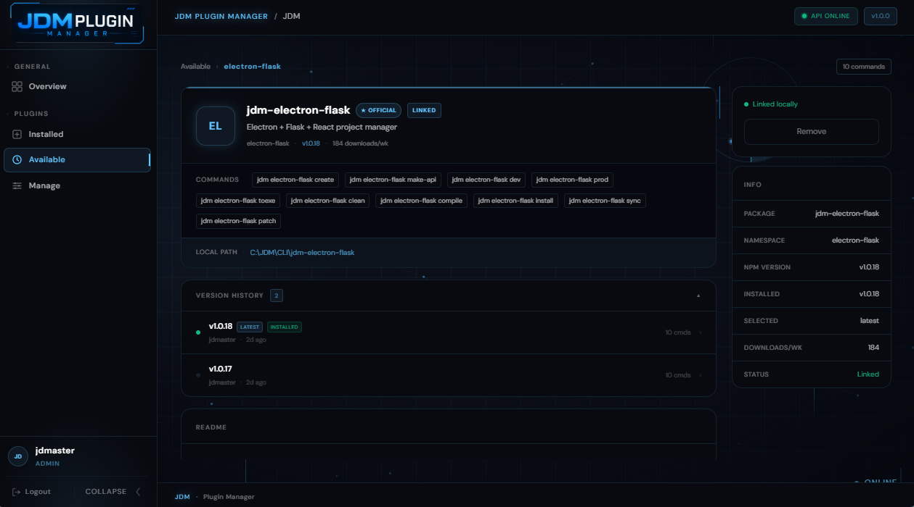
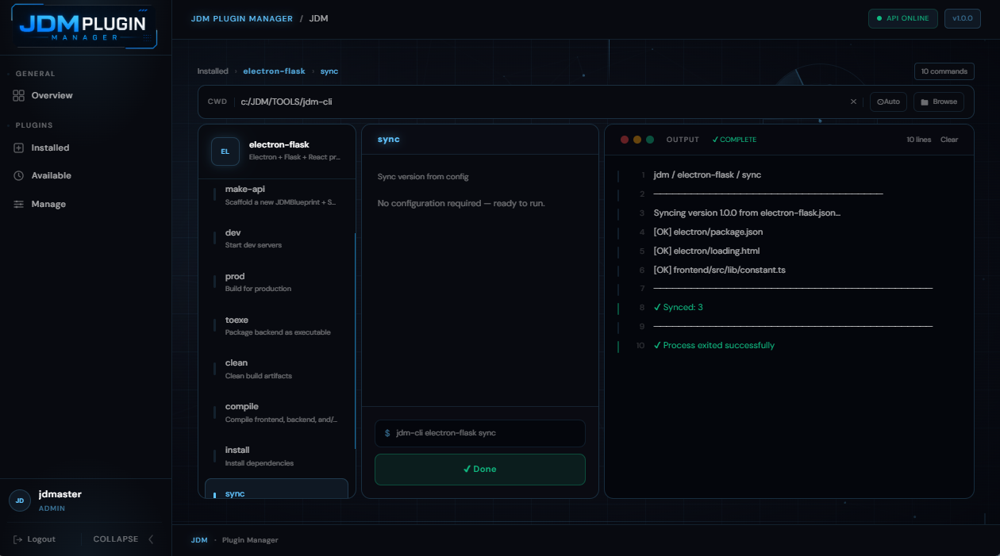

# JDM Plugin Manager

A desktop app for discovering, installing, and running JDM plugins — all from one place.

---

## What it does

**Browse & install plugins** — Search the plugin catalog, view descriptions and available commands, and install what you need with one click. You can also check if any of your installed plugins have updates available.

**Run plugins** — Pick an installed plugin, choose a command, fill in the options, and run it. Output streams live in the terminal panel. If a plugin needs input mid-run, it'll prompt you right there without interrupting the flow.

**Manage your working directory** — Set a working directory before running a plugin. The app can detect your currently open Explorer folder or VS Code workspace and suggest it automatically, or you can browse for one manually.

**Link local plugins** — Working on a plugin locally? Link it directly from your machine by pointing to its folder. It reads the package info automatically and lets you run it just like any installed plugin.

**Publish plugins** — If you're an npm user, you can submit your own plugin to the catalog. The app ties into your npm account (via `npm whoami`) so there's no separate login. Once linked and published to npm, you can push a version for review.

**Dashboard** — A quick overview of what's installed, what's linked, what has updates, and what's recently been added to the catalog.

---

## Screenshots

**Login Screen**

**Dashboard Screen**

**Installed Screen**

**Available SCreen**

**Manage Plugin Screen**

**View Screen**

**Runner Screen**

---

## Requirements

- [Node.js](https://nodejs.org/) — required to run plugins

---

## Installation

Download the latest installer from the [Releases](../../releases) page and run it. The app lives in your system tray after launch so it's always a click away.

---

## For contributors

The app is built on Electron with a Python (Flask) backend and a React frontend. Plugins are Node.js packages that export a `run()` function — the app handles the rest (argument passing, stdin/stdout, prompts, live output).